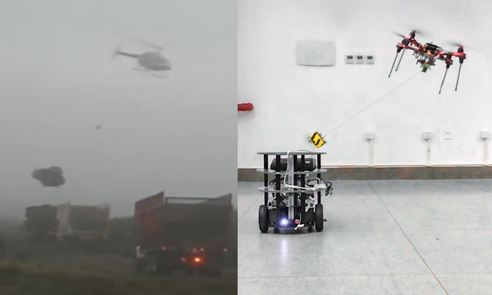

# Vision-encoder-based Payload State Estimation for Autonomous MAV With a Suspended Payload

Autonomous delivery of suspended payloads with MAVs has many applications in rescue and logistics transportation. Robust and online estimation of the payload status is important but challenging especially in outdoor environments. The paper develops a novel real-time system for estimating the payload position; the system consists of a monocular fisheye camera and a novel encoder-based device. A Gaussian fusion-based estimation algorithm is developed to obtain the payload state estimation. Based on the robust payload position estimation, a payload controller is presented to ensure the reliable tracking performance on aggressive trajectories. Several experiments are performed to validate the high performance of the proposed method

**Authors:** [Jianheng Liu](https://github.com/jianhengLiu), [Yunfan Ren](https://github.com/RENyunfan), [Haoyao Chen](faculty.hitsz.edu.cn/chenhaoyao), and [Yunhui Liu](ri.cuhk.edu.hk/yhliu) from the [Networked Robotics and Systems Lab in Harbin Institute of Technology Shenzhen](http://nrs-lab.com/)

Due to the unique mechanism design, it it recommended to try our [Simulation](./Simulation) on simulator platform [CoppeliaSim](https://www.coppeliarobotics.com/coppeliaSim). The real world estimator is also provided in [Estimator](./Estimator)

**Related Paper**

- **Vision-encoder-based Payload State Estimation for Autonomous MAV With a Suspended Payload**, Jianheng Liu, Yunfan Ren, Haoyao Chen, and Yunhui Liu, IEEE/RSJ International Conference on Intelligent Robots and Systems (IROS, 2021)[pdf](./paper/iros2021.pdf)

**Video**

<iframe height="400" width="600" src="//player.bilibili.com/player.html?aid=590278777&bvid=BV1Qq4y1U7n4&cid=404680713&page=1" scrolling="no" border="0" frameborder="no" framespacing="0" allowfullscreen="true"> </iframe>

<iframe height="400" width="600" src="//player.bilibili.com/player.html?aid=207782584&bvid=BV1fh411W7ht&cid=404682581&page=1" scrolling="no" border="0" frameborder="no" framespacing="0" allowfullscreen="true"> </iframe>

<iframe height="400" width="600" src="//player.bilibili.com/player.html?aid=720370723&bvid=BV1eQ4y1a77v&cid=404681647&page=1" scrolling="no" border="0" frameborder="no" framespacing="0" allowfullscreen="true"> </iframe>
